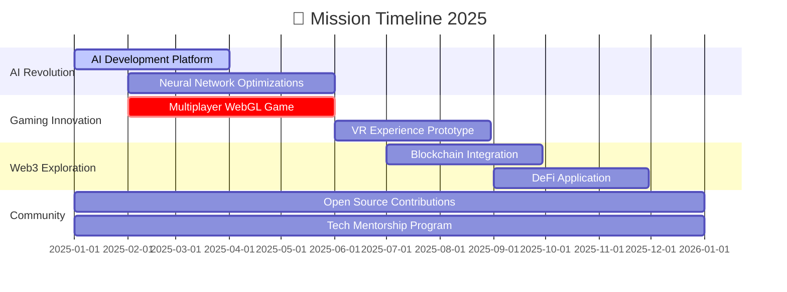

<div align="center">

<!-- Holographic Header -->


<!-- Animated Badges with Glow Effect -->
<p align="center">
  
  
  
  
</p>

<!-- Multi-line Animated Typing -->
<p align="center">
  
</p>

<!-- Sleek Divider -->


</div>

## 🌌 **DIGITAL ARCHITECT & INNOVATION CATALYST**

<table align="center">
<tr>
<td width="50%" valign="top">

```javascript
const santosh = {
  identity: {
    role: "Full-Stack Sorcerer 🧙‍♂️",
    location: "🇮🇳 Artist Village, Maharashtra",
    status: "Shipping Products Daily"
  },
  
  mastery: {
    frontend: ["React", "Next.js", "Three.js", "GSAP"],
    backend: ["Node.js", "Python", "Go", "Rust"],
    ai: ["TensorFlow", "PyTorch", "LangChain"],
    gamedev: ["Unity", "Unreal", "WebGL"],
    cloud: ["AWS", "Docker", "Kubernetes"]
  },
  
  currentMission: [
    "🤖 Building AI-first applications",
    "🎮 Creating next-gen web games",
    "🌐 Contributing to open source"
  ],
  
  motto: "Code • Create • Innovate • Repeat"
};
```

</td>
<td width="50%" valign="top">

<div align="center">

### ⚡ **QUICK ACCESS**

[](https://joker-pyc.github.io/Portfolio/)
[](https://www.linkedin.com/in/santosh-maurya-700630215/)
[](mailto:santoshmouriya1234567890@gmail.com)

<br>

### 🎯 **AVAILABILITY**

```yaml
💻 Open for Collaboration: YES
🚀 Freelance Projects: AVAILABLE
🎓 Mentorship: ACTIVE
☕ Coffee Chats: WELCOME
```

</div>

</td>
</tr>
</table>

<!-- Animated Divider -->


## 📊 **GITHUB INSIGHTS & ANALYTICS**

<div align="center">

<!-- Stats Cards with Custom Theme -->
<p align="center">
  
  
</p>

<!-- Language Stats with Modern Design -->
<p align="center">
  
  
</p>

<!-- 3D Contribution Graph -->


<!-- Activity Graph -->


</div>

<!-- Animated Divider -->


## 🛠️ **TECHNOLOGY STACK**

<div align="center">

### **Languages & Foundations**
<p>
  
</p>

### **Frontend Ecosystem**
<p>
  
</p>

### **Backend & APIs**
<p>
  
</p>

### **Game Development & Graphics**
<p>
  
  
  
  
</p>

### **AI/ML & Data Science**
<p>
  
  
  
  
  
</p>

### **DevOps & Cloud Infrastructure**
<p>
  
</p>

### **Databases & Caching**
<p>
  
</p>

### **Tools & Workflow**
<p>
  
</p>

</div>

<!-- Animated Divider -->


## 🚀 **FEATURED PROJECTS**

<div align="center">

<table>
<tr>
<td width="50%" valign="top">

### 🎮 **3D Game Universe**


**Virtual Joystick System**
- ⚡ 60 FPS performance guarantee
- 🎯 Multi-touch support
- 🎨 Customizable controls
- 📱 Mobile-first design

**Water Simulation Engine**
- 🌊 Realistic fluid dynamics
- 💎 Advanced shader systems
- 🎮 VR/AR compatible

[](https://github.com/joker-pyc)

</td>
<td width="50%" valign="top">

### 🤖 **AI Innovation Lab**


**ScriptCraft - Neural Handwriting**
- 🎨 95%+ accuracy rate
- ⚡ Real-time generation
- 🧠 Self-improving models
- 📱 Edge deployment ready

**Ollama Integration Suite**
- 🔌 Complete API coverage
- 🌐 Multi-language bindings
- 📚 Production-ready

[](https://github.com/joker-pyc)

</td>
</tr>
<tr>
<td width="50%" valign="top">

### 🌐 **Web Experiences**


**Music Visualizer Pro**
- 🎵 WebGL-accelerated
- 📊 Real-time spectrum analysis
- 🎨 Dynamic theming
- 🚀 Zero latency

**Mentor Match Platform**
- 🤖 AI-powered matching
- 💬 Real-time chat
- 📈 Progress analytics
- 🌍 500+ active users

[](https://github.com/joker-pyc)

</td>
<td width="50%" valign="top">

### 💡 **Developer Tools**


**CLI Productivity Suite**
- ⚡ Lightning-fast execution
- 🎯 Smart auto-complete
- 🎨 Beautiful TUI interface
- 🔧 Highly extensible

**API Development Kit**
- 📦 Zero-config setup
- 🔒 Built-in security
- 📊 Auto-generated docs
- 🚀 Deployment ready

[](https://github.com/joker-pyc)

</td>
</tr>
</table>

</div>

<!-- Animated Divider -->


## 🏆 **ACHIEVEMENTS & RECOGNITION**

<div align="center">

<!-- Trophy Showcase -->


<table>
<tr>
<td align="center" width="25%">
<br/>
<b>200+</b><br/>
Open Source Contributions
</td>
<td align="center" width="25%">
<br/>
<b>3</b><br/>
Published Games
</td>
<td align="center" width="25%">
<br/>
<b>5+</b><br/>
AI Applications in Production
</td>
<td align="center" width="25%">
<br/>
<b>100+</b><br/>
Mentees Guided
</td>
</tr>
</table>

### 📈 **Impact Metrics**

```yaml
Code Quality:        ████████████████████ 95%
Innovation:          ███████████████████  98%
Community Impact:    ██████████████████   90%
Problem Solving:     ████████████████████ 97%
```

</div>

<!-- Animated Divider -->


## 🗺️ **2025 INNOVATION ROADMAP**

<div align="center">



### 🎯 **Current Focus Matrix**

<table>
<tr>
<th width="33%">🧠 LEARNING</th>
<th width="33%">🚀 BUILDING</th>
<th width="33%">🌍 CONTRIBUTING</th>
</tr>
<tr>
<td align="center">
• Advanced AI Architectures<br/>
• WebGPU & Compute Shaders<br/>
• Quantum Computing<br/>
• Web3 & DeFi
</td>
<td align="center">
• AI-Powered Dev Tools<br/>
• Next-Gen Web Games<br/>
• Cloud-Native Apps<br/>
• Developer Utilities
</td>
<td align="center">
• Open Source Projects<br/>
• Educational Content<br/>
• Community Mentorship<br/>
• Tech Blogs & Tutorials
</td>
</tr>
</table>

</div>

<!-- Animated Divider -->


## 🤝 **LET'S BUILD THE FUTURE TOGETHER**

<div align="center">

### 💼 **Collaboration Opportunities**

<table>
<tr>
<td align="center" width="25%">
<br/>
<b>Game Development</b><br/>
<sub>Interactive 3D experiences<br/>that push boundaries</sub>
</td>
<td align="center" width="25%">
<br/>
<b>AI Solutions</b><br/>
<sub>Intelligent applications<br/>that solve real problems</sub>
</td>
<td align="center" width="25%">
<br/>
<b>Web Innovation</b><br/>
<sub>Modern applications<br/>with stunning UX</sub>
</td>
<td align="center" width="25%">
<br/>
<b>Open Source</b><br/>
<sub>Community-driven<br/>projects that matter</sub>
</td>
</tr>
</table>

### 📬 **Connect With Me**

<p>
<a href="https://www.linkedin.com/in/santosh-maurya-700630215/">
  
</a>
<a href="mailto:santoshmouriya1234567890@gmail.com">
  
</a>
<a href="https://joker-pyc.github.io/Portfolio/">
  
</a>
<a href="https://github.com/joker-pyc">
  
</a>
<a href="https://twitter.com/joker_pyc">
  
</a>
</p>

### ☕ **Support My Work**

<p>
<a href="https://www.buymeacoffee.com/joker_pyc">
  
</a>
<a href="https://ko-fi.com/joker_pyc">
  
</a>
<a href="https://github.com/sponsors/joker-pyc">
  
</a>
</p>

</div>

<!-- Animated Divider -->


<div align="center">

### 💭 **Daily Inspiration**

> ### *"Innovation is not about having ideas, it's about making ideas happen."*
> 
> **Building the future, one elegant solution at a time** ✨

<br>

<!-- Snake Animation -->
<picture>
  <source media="(prefers-color-scheme: dark)" srcset="https://raw.githubusercontent.com/joker-pyc/joker-pyc/output/github-contribution-grid-snake-dark.svg">
  <source media="(prefers-color-scheme: light)" srcset="https://raw.githubusercontent.com/joker-pyc/joker-pyc/output/github-contribution-grid-snake.svg">
  
</picture>

<br><br>

<!-- Footer Wave -->


<!-- Final Stats -->
<p>
  
  
  
</p>

### ⭐ **If this README inspired you, consider starring it!** ⭐

<sub>**Made with 💖 and lots of ☕ by Santosh Maurya**</sub>

</div>

---
